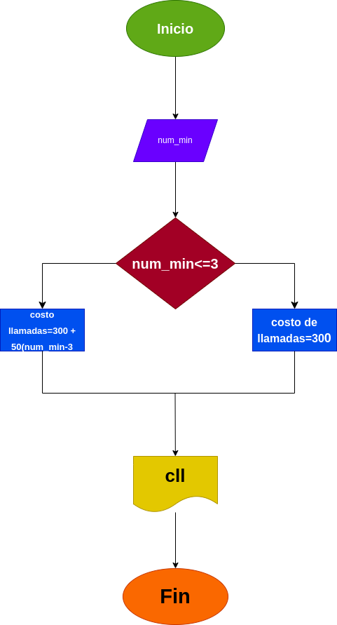

# llamada_telefonica
Ingresar el tiempo de duracion de una llamada telefonica y determunar la cantidad a pagar, deacuerdo con lo siguiente: 
- Toda llamada que dure 3 minutos o menos tiene un costo de 300 pesos.
- Cada minuto adicional cuesta 50 pesos.

# Diagrama de Flujo
